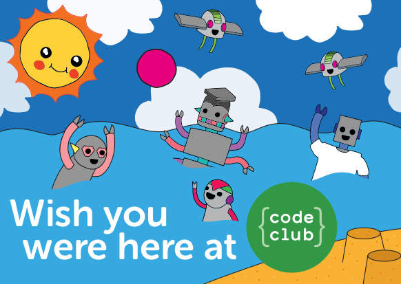
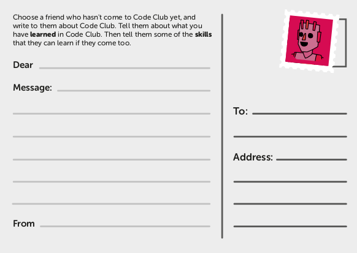

## Plenary

There are 3 sections in the Plenary:
1. Game: Skills sorting (again)
2. Postcard
3. Post-Module Survey

### 1. Game: Skills sorting

--- task ---

You need to play Skills sorting game again so you can reflect on your progress. Don't forget to tick the activity off once you have completed it.

Click the [I’ve got a Scratch account](https://scratch.mit.edu/projects/482235800){:target="_blank"} link to _log in_ and play the Skills sorting game. 

If you don’t have a Scratch account, you can still play the Skills sorting game by clicking the [I don't have a Scratch account](https://scratch.mit.edu/projects/326271944){:target="_blank"} link.

--- /task ---

### 2. Postcard

--- task ---

Now you’re going to write a real postcard. Your Code Club Facilitator will have one for you. The postcard looks like this:

Here are some instructions on how to write your postcard - the instructions underlined in italics are also given on the printed postcard as well:

<i> <u> Choose a friend who hasn't come to Code Club yet, and write to them about Code Club. Tell them about what you have learned in Code Club. Then tell them some of the skills that they can learn if they come too.</u></i>

Try choosing someone who you think would really benefit from the experience and, especially, someone who wouldn’t usually consider attending the club.

In section ‘Dear’, write your friend or fellow student’s first name. Don’t forget on the right-hand side of the postcard to also write their name again in the ‘To’ section with their surname as well as their school address in the ‘Address’ section.

In section ‘Message’, start your personal note to your friend or fellow student with what you have learned by attending Code Club. Then tell some of the skills that they will develop if they attend Code Club.

In section ‘From’, write your first name and surname.

That’s it! Don't forget to give the postcard to your Code Club facilitator.

Now simply complete the post-activity survey below and you’ve finished a whole module. Well done!

--- /task ---

### 3. Post-Module Survey

--- task ---

Please complete this post-module survey before you move on to another module.
Click finish when you’re done :)

http://ncce.io/iClub-post

--- /task ---

Click on the 'Click me' button to try a new module:

<a href="https://codeclub.org/en/projects-cc">

